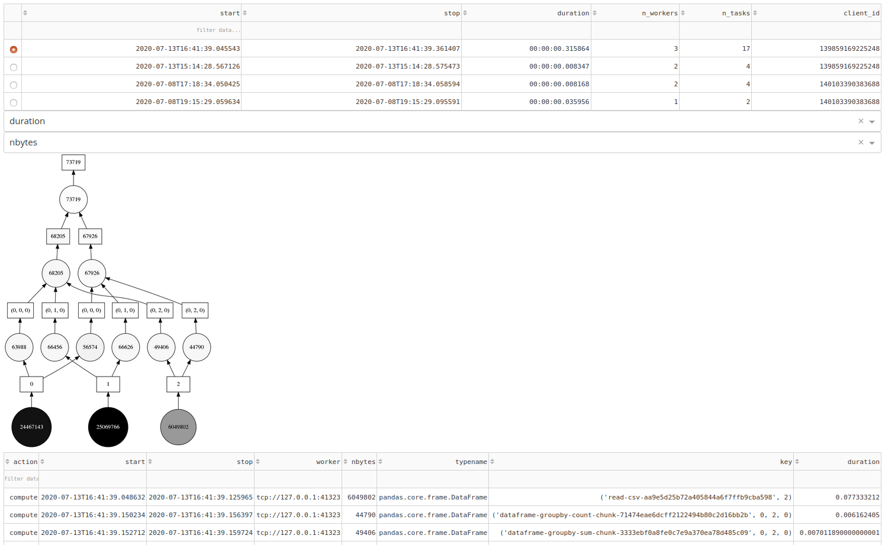

# Dask Log Server

> The goal of this project is to preserve all necessary runtime data of a Dask client in order to "replay" and analyze the performance and behavior of the client after the fact.

Here you can see an early prototype of the dashboard. The top table shows all executed task graphs. The selected task graph is visualized. The table at the bottom contains information of each task, which was executed during that graph execution. With the two drop down menus it is possible to enhance the visualization of the graph with additional information. Right now the color is set to the duration of the task and the label is set to the size of the data. Other options are worker and typename for both color and label, but every numerical or string value can be used (including custom ones). All the information in the dashboard can also be accessed programmatically.



## How to use

This is a quick guide and everything can change any moment. If you are stuck, feel free to open an issue.

1. Configure the logger as shown in the docstring of the function dask_logger_config.
2. If you don't want to log the system state of every worker every second you can disable that with `client.info_logger.do_run = False`
3. Do some computations! For every computation a new file ending on `.dsk` should appear and every time interval (default is 60s) a `taskXXX.jsonl` should be updated if there are new tasks.
4. Update `log_path` to your logging path and execute the following code. This saves the necessary files for the dashboard.
```python
import dask_log_server

log_path = "logs"
df_tasks = dask_log_server.read_tasks(log_path)
   dask.compute([
       df_tasks.to_parquet(log_path + "/tasks.parquet/", compute=False),
       dask_log_server.read_graphs(df_tasks).to_parquet(log_path + "/graph.parquet", compute=False)
   ])
```
5. Execute `python app.py <logging-path>` in the console and follow the instructions.
6. Have fun browsing your logs!


## Vision

Below is the vision of the project, so you know which direction it will take. Feel free to leave feedback.

### Client

The goal is to collect the logs via a plugin of the client class of dask distributed. With HTML output in Jupyter Lab you can start and stop logging and get info about the current status of the logger.

### Server Collection

I'm currently not sure what to use as a logging server. For now I'll probably just implement a RestAPI and save it to S3. The collection server should be able to collect logs from multiple sources.

### Server Dashboard

The goal is to display the same graphics which are currently available in the dask dashboard, but for all collected data from the past. Additionally new visualization may be needed which compare task graphs or aggregate the information of multiple task graphs.

For now this is only a side project, but it would be really cool to make this an official Dask repository.

